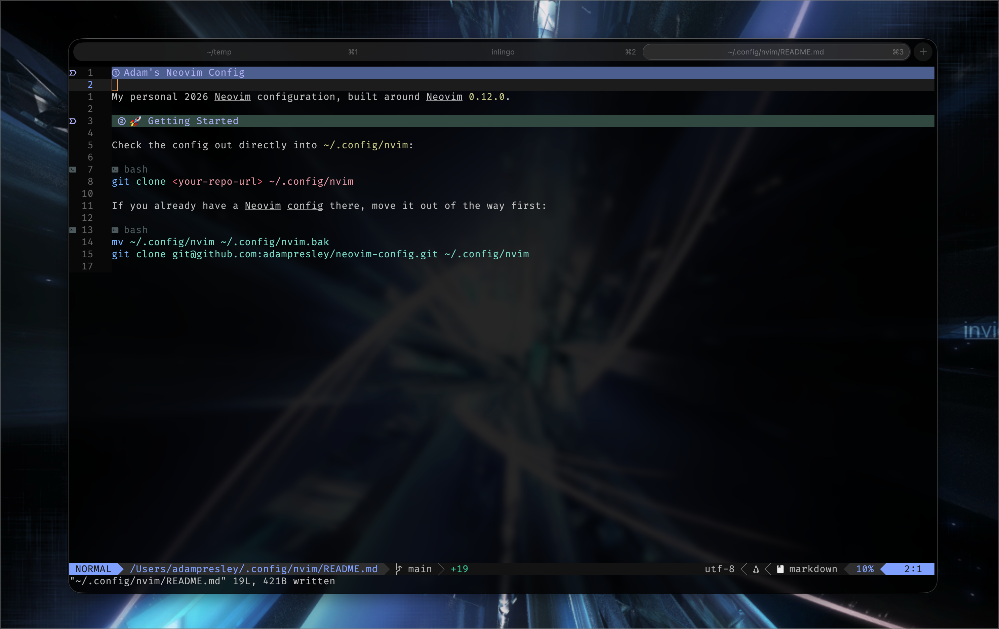
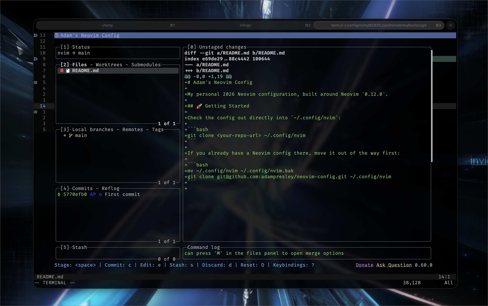
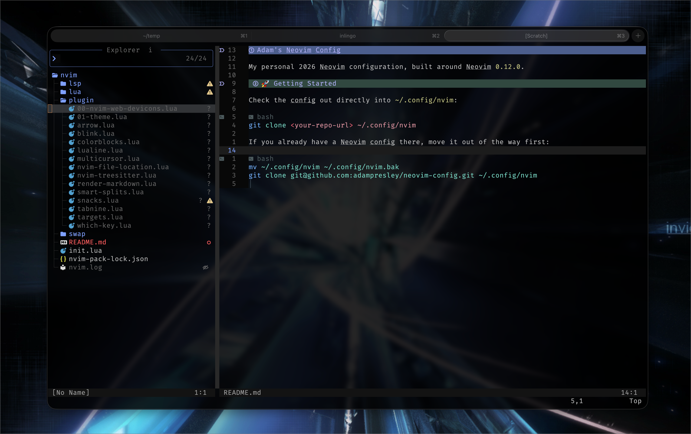
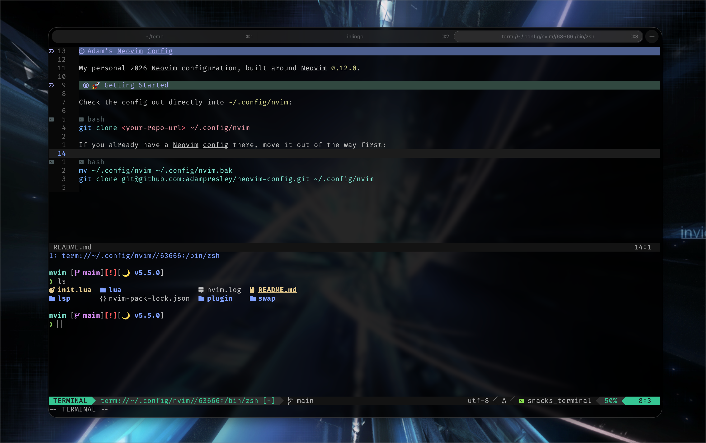

# Adam's Neovim Config

My personal 2026 Neovim configuration, built around Neovim `0.12.0`.

## 🚀 Getting Started

Check the config out directly into `~/.config/nvim`:

```bash
git clone <your-repo-url> ~/.config/nvim
```

If you already have a Neovim config there, move it out of the way first:

```bash
mv ~/.config/nvim ~/.config/nvim.bak
git clone git@github.com:adampresley/neovim-config.git ~/.config/nvim
```

## Screenshots

_2026 screenshots_










